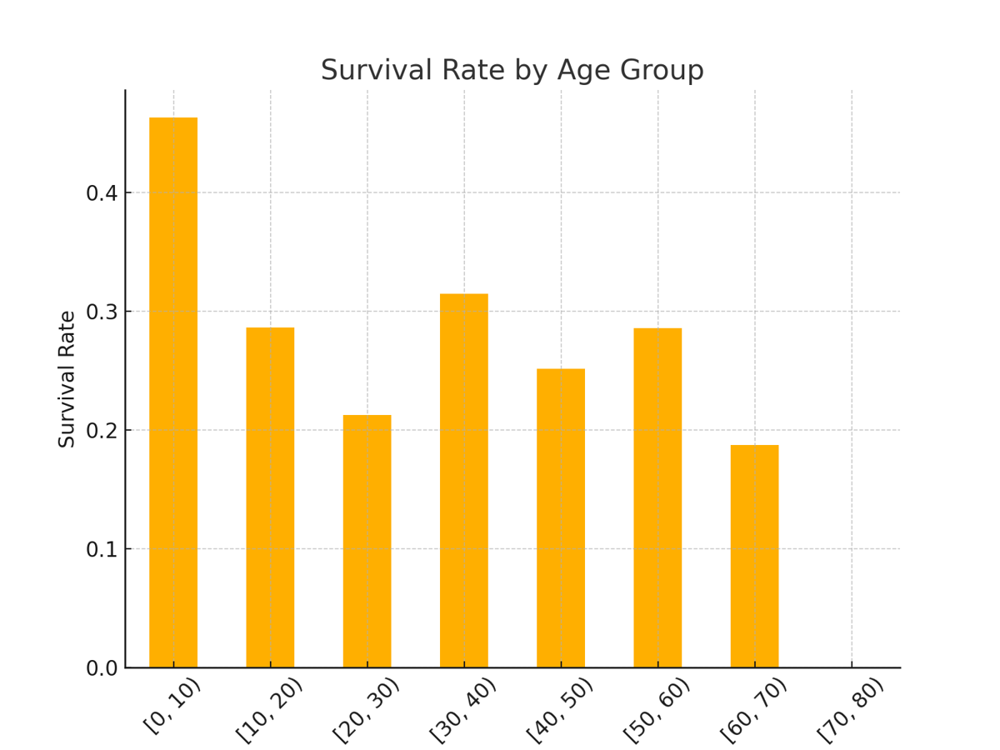
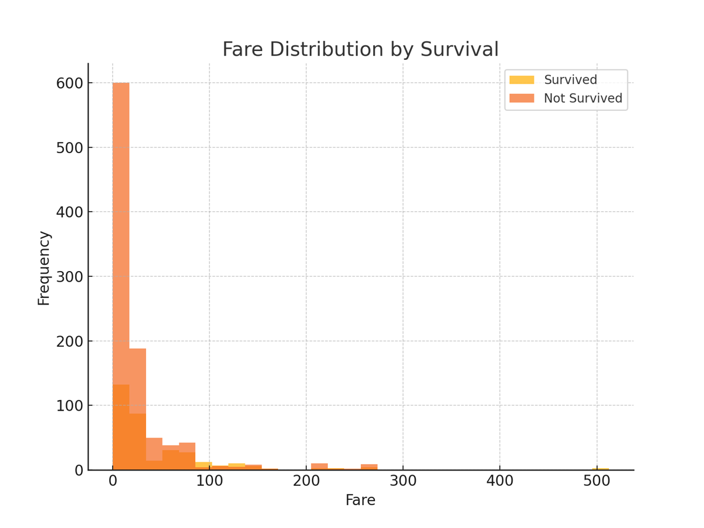
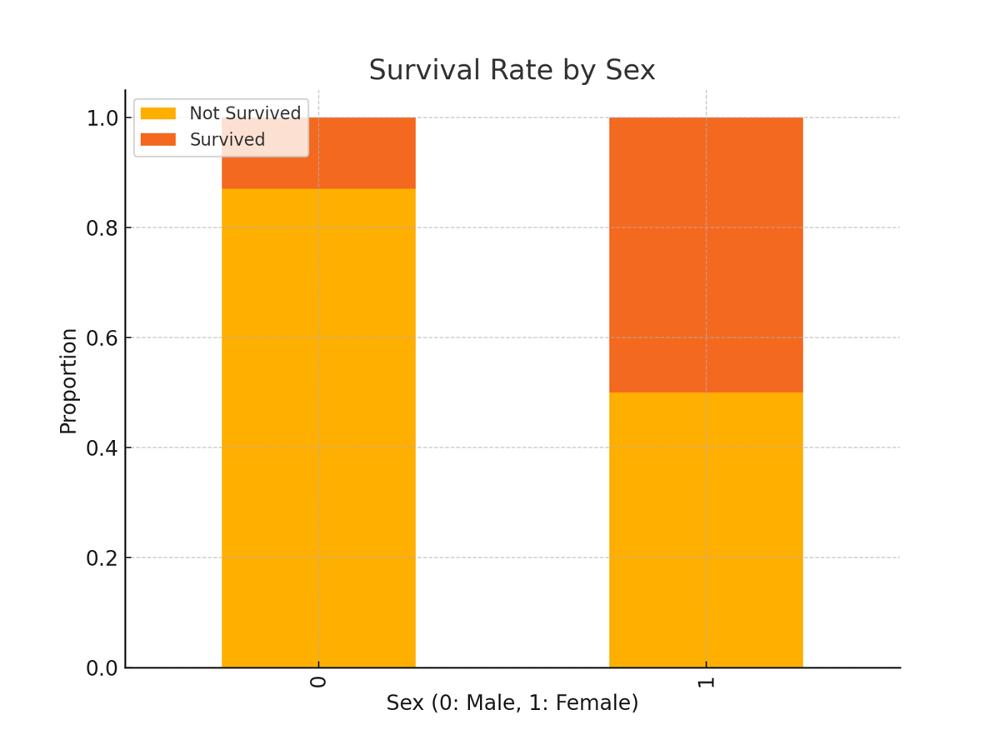
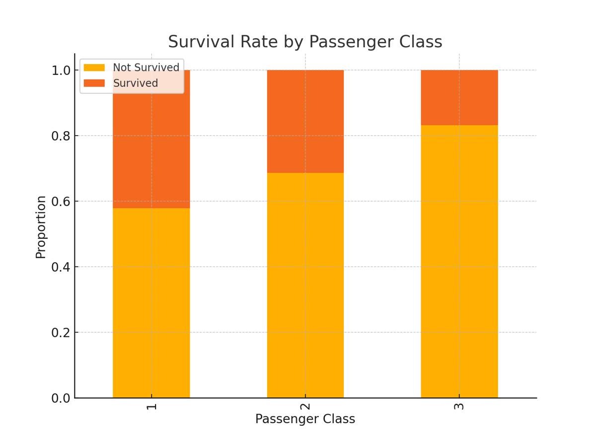
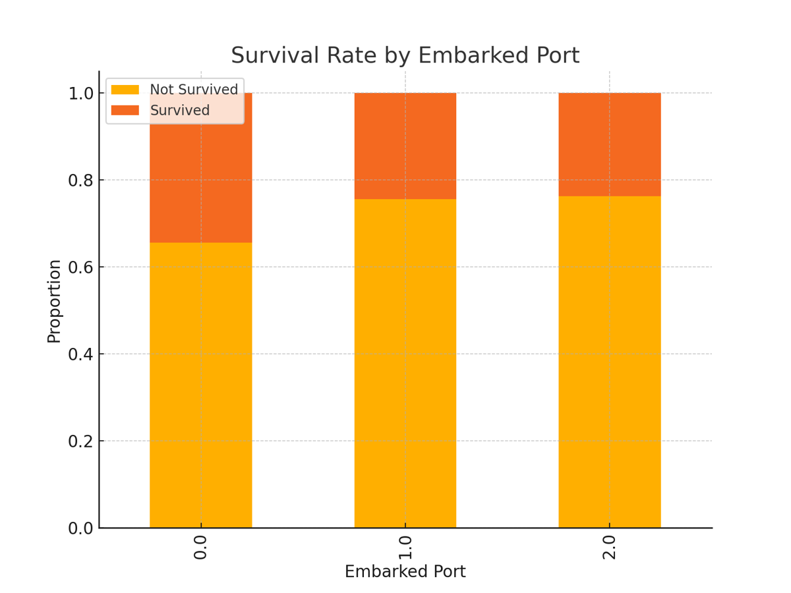

# 타이타닉 데이터 분석 시나리오

## 1단계) 업로드한 데이터 파일을 분석해주세요
=> 전체 데이터의 행과 열, 주요 칼럼(변수) 정리

```python
file_path = '/mnt/data/titanic.csv'
titanic_df = pd.read_csv(file_path)
titanic_df.head()
```
<br>

## 2단계) 타이타닉에서 생존한 사람들의 특징은 무엇인가요?
=> 주요 변수에 대한 생존률을 파악 후 전체적인 분석을 한다.

```python
# 데이터셋을 필터링하여 생존자만 포함합니다.
survived_df = titanic_df[titanic_df['Survived'] == 1]

# 생존자의 특성을 분석합니다.
# 평균 연령, 요금, 성별 분포, 클래스 분포 등을 확인합니다.
survived_characteristics = {
    '평균 연령': survived_df['Age'].mean(),
    '평균 요금': survived_df['Fare'].mean(),
    '성별 분포': survived_df['Sex'].value_counts(normalize=True),
    '클래스 분포': survived_df['Pclass'].value_counts(normalize=True),
    '형제/배우자 분포': survived_df['sibsp'].value_counts(normalize=True),
    '부모/자녀 분포': survived_df['Parch'].value_counts(normalize=True),
    '탑승 항구 분포': survived_df['Embarked'].value_counts(normalize=True)
}

survived_characteristics

```
<br>

## 3단계) 각 특성들이 통계적으로 유의한지 검정해주고 결과를 각각 표로 요약해주세요.
=> p-value 사용하여, 분석 결과가 통계적으로 유의한지 검정을 한다.  
=> 주어진 데이터가 특정 가설을 만족하는지 확인하는 과정이다.

```python
from scipy.stats import ttest_ind, chi2_contingency
import numpy as np

# 테스트 결과를 저장할 딕셔너리를 초기화합니다.
statistical_significance = []

# 그룹 정의: 생존자와 비생존자
survived = titanic_df[titanic_df['Survived'] == 1]
not_survived = titanic_df[titanic_df['Survived'] == 0]

# 숫자형 특징에 대한 t-검정 수행: Age, Fare
for feature in ['Age', 'Fare']:
    t_stat, p_val = ttest_ind(survived[feature], not_survived[feature], nan_policy='omit')
    statistical_significance.append({
        'Feature': feature,
        'Test': 't-test',
        'Test Statistic': t_stat,
        'p-value': p_val,
        'Significant': p_val < 0.05
    })

# 범주형 특징에 대한 카이제곱 검정 수행: Sex, Pclass, Embarked, sibsp, Parch
# 참고: 카이제곱 검정을 위해 범주형 특징을 교차표로 변환

# Sex
sex_contingency = pd.crosstab(titanic_df['Sex'], titanic_df['Survived'])
chi2_stat, p_val, _, _ = chi2_contingency(sex_contingency)
statistical_significance.append({
    'Feature': 'Sex',
    'Test': 'Chi-square',
    'Test Statistic': chi2_stat,
    'p-value': p_val,
    'Significant': p_val < 0.05
})

# Pclass
pclass_contingency = pd.crosstab(titanic_df['Pclass'], titanic_df['Survived'])
chi2_stat, p_val, _, _ = chi2_contingency(pclass_contingency)
statistical_significance.append({
    'Feature': 'Pclass',
    'Test': 'Chi-square',
    'Test Statistic': chi2_stat,
    'p-value': p_val,
    'Significant': p_val < 0.05
})

# Embarked
# Embarked에서 NA 값을 제거합니다. 카이제곱은 결측 데이터를 처리하지 않습니다.
embarked_contingency = pd.crosstab(titanic_df['Embarked'].dropna(), titanic_df['Survived'][titanic_df['Embarked'].notna()])
chi2_stat, p_val, _, _ = chi2_contingency(embarked_contingency)
statistical_significance.append({
    'Feature': 'Embarked',
    'Test': 'Chi-square',
    'Test Statistic': chi2_stat,
    'p-value': p_val,
    'Significant': p_val < 0.05
})

# sibsp
sibsp_contingency = pd.crosstab(titanic_df['sibsp'], titanic_df['Survived'])
chi2_stat, p_val, _, _ = chi2_contingency(sibsp_contingency)
statistical_significance.append({
    'Feature': 'sibsp',
    'Test': 'Chi-square',
    'Test Statistic': chi2_stat,
    'p-value': p_val,
    'Significant': p_val < 0.05
})

# Parch
parch_contingency = pd.crosstab(titanic_df['Parch'], titanic_df['Survived'])
chi2_stat, p_val, _, _ = chi2_contingency(parch_contingency)
statistical_significance.append({
    'Feature': 'Parch',
    'Test': 'Chi-square',
    'Test Statistic': chi2_stat,
    'p-value': p_val,
    'Significant': p_val < 0.05
})

# 결과를 표시하기 위해 데이터프레임으로 변환
significance_df = pd.DataFrame(statistical_significance)

import ace_tools as tools; tools.display_dataframe_to_user(name="Statistical Significance of Titanic Survival Factors", dataframe=significance_df)
```
<br>

## 4단계) 분석한 결과를 시각화해주세요. (나이의 경우, 10살씩 범주화해서 분석.)

```python
import matplotlib.pyplot as plt

# 데이터 시각화를 위한 연령대를 설정하여 나이 구간을 나눕니다.
titanic_df['AgeGroup'] = pd.cut(titanic_df['Age'], bins=range(0, 81, 10), right=False)

# 시각화를 위한 데이터 준비
# 1. 연령대별 생존율
age_group_survival = titanic_df.groupby('AgeGroup')['Survived'].mean()

# 2. 생존 여부에 따른 요금 분포
fare_survived = survived_df['Fare']
fare_not_survived = not_survived['Fare']

# 3. 성별에 따른 생존율
sex_survival = pd.crosstab(titanic_df['Sex'], titanic_df['Survived'], normalize='index')

# 4. 클래스에 따른 생존율
pclass_survival = pd.crosstab(titanic_df['Pclass'], titanic_df['Survived'], normalize='index')

# 5. 탑승 항구에 따른 생존율
embarked_survival = pd.crosstab(titanic_df['Embarked'].dropna(), titanic_df['Survived'][titanic_df['Embarked'].notna()], normalize='index')

# 연령대별 생존율을 시각화
plt.figure(figsize=(8, 6))
age_group_survival.plot(kind='bar')
plt.title('연령대별 생존율')
plt.xlabel('연령대')
plt.ylabel('생존율')
plt.xticks(rotation=45)
plt.show()

# 생존 여부에 따른 요금 분포 시각화
plt.figure(figsize=(8, 6))
plt.hist(fare_survived, bins=30, alpha=0.7, label='생존')
plt.hist(fare_not_survived, bins=30, alpha=0.7, label='비생존')
plt.title('생존 여부에 따른 요금 분포')
plt.xlabel('요금')
plt.ylabel('빈도수')
plt.legend()
plt.show()

# 성별에 따른 생존율 시각화
sex_survival.plot(kind='bar', stacked=True, figsize=(8, 6))
plt.title('성별에 따른 생존율')
plt.xlabel('성별 (0: 남성, 1: 여성)')
plt.ylabel('비율')
plt.xticks(rotation=0)
plt.legend(['비생존', '생존'])
plt.show()

# 클래스에 따른 생존율 시각화
pclass_survival.plot(kind='bar', stacked=True, figsize=(8, 6))
plt.title('승객 클래스에 따른 생존율')
plt.xlabel('승객 클래스')
plt.ylabel('비율')
plt.xticks(rotation=0)
plt.legend(['비생존', '생존'])
plt.show()

# 탑승 항구에 따른 생존율 시각화
embarked_survival.plot(kind='bar', stacked=True, figsize=(8, 6))
plt.title('탑승 항구에 따른 생존율')
plt.xlabel('탑승 항구')
plt.ylabel('비율')
plt.xticks(rotation=0)
plt.legend(['비생존', '생존'])
plt.show()
```
<br>

## 5단계) 결과를 바탕으로 보고서 생성하기 (타이타닉 데이터 분석 보고서)

### 데이터 개요
- **데이터셋**: 타이타닉 탑승자 정보 (총 1309명)
- **주요 특성**: 나이, 티켓 요금, 성별, 탑승 클래스, 형제자매/배우자 수, 부모/자녀 수, 탑승 항구
- **목적**: 각 특성이 생존에 미친 영향을 분석하여 생존자의 특징을 파악

### 주요 분석 결과 요약
- **나이**: 어린 승객의 생존율이 높음
- **요금**: 높은 티켓 요금이 높은 생존율과 연관됨
- **성별**: 여성 승객의 생존율이 높음
- **클래스**: 높은 클래스 승객일수록 생존율이 높음
- **탑승 항구**: 특정 항구에서 탑승한 승객의 생존율이 높음

### 연령대별 생존율 분석
- 10세 단위로 나눈 연령대에서 어린 승객일수록 생존율이 높은 경향이 관찰됩니다.



### 요금 분포에 따른 생존 여부
- 티켓 요금이 높을수록 생존율이 높아지는 경향이 있으며, 요금 분포에 따른 생존 여부를 확인할 수 있습니다.



### 성별에 따른 생존율
- 여성 승객의 생존율이 남성 승객보다 현저히 높으며, 성별이 생존율에 중요한 영향을 미쳤음을 알 수 있습니다.



### 탑승 클래스에 따른 생존율
- 1등석 승객의 생존율이 가장 높고, 클래스가 낮아질수록 생존율이 감소하는 경향이 보입니다.



### 탑승 항구에 따른 생존율
- 특정 항구에서 탑승한 승객의 생존율이 높으며, 항구별 탑승이 생존에 미친 영향을 확인할 수 있습니다.
  - 0: Southampton
  - 1: Cherbourg
  - 2: Queenstown



이제 이미지 경로가 올바르게 변경되었습니다. GitHub에 반영하신 후 잘 작동하는지 확인해 보세요. 필요한 추가 수정이 있으면 알려주세요!

